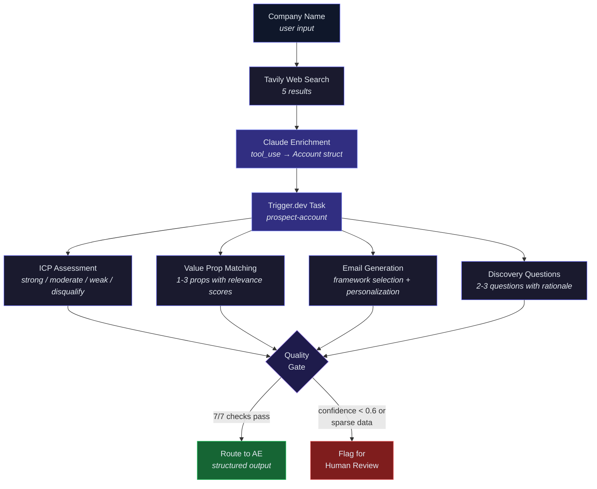

# Rula Prospecting Agent

AI-powered account qualification and outreach generation for Rula's employer AE sales motion. Takes a company name, enriches it from the web, assesses ICP fit, matches value propositions, and generates personalized email outreach — all through structured Claude outputs.

**Live demo:** [web-topaz-one-90.vercel.app](https://web-topaz-one-90.vercel.app/?key=rula-case-study-2026)

---

## Architecture



---

## Project Structure

```
prospecting_agent/
├── src/
│   ├── config.ts              # Model ID, ICP criteria, value prop definitions, system prompt
│   ├── schemas.ts             # Zod schemas — Account, ProspectingOutput, QualityResult
│   ├── prospecting.ts         # Core agent logic — runProspectingAgent(), evaluateOutput()
│   └── trigger/
│       ├── prospect-account.ts  # Single-account task (validate → agent → quality gate)
│       └── prospect-all.ts      # Fan-out task (batch all accounts in parallel)
├── data/
│   └── accounts.json          # 8 fictional test accounts across ICP segments
├── web/                       # Next.js 15 frontend (deployed to Vercel)
│   ├── app/
│   │   ├── page.tsx             # Access-gated main page with showcase + live analysis
│   │   ├── layout.tsx           # Fraunces + Figtree fonts, global styles
│   │   ├── globals.css          # Tailwind v4 theme (warm neutrals + Rula purple)
│   │   └── api/
│   │       ├── prospect/route.ts  # POST — enriches company, triggers task
│   │       └── status/route.ts    # GET — polls task run status
│   ├── components/
│   │   ├── showcase-section.tsx   # Tabbed pre-computed results for 3 accounts
│   │   ├── prospect-results.tsx   # Score bars, email preview, expandable toggles
│   │   ├── enrichment-preview.tsx # Fact rows for enriched account data
│   │   └── search-form.tsx        # Company name input
│   ├── lib/
│   │   ├── enrichment.ts       # Tavily search → Claude tool_use → Account struct
│   │   └── types.ts            # TypeScript interfaces mirroring Zod schemas
│   ├── data/
│   │   └── showcase.json       # Pre-computed results for demo accounts
│   └── scripts/
│       └── generate-showcase.mjs  # Generates showcase.json via Claude API
├── trigger.config.ts          # Trigger.dev project config
└── package.json               # Root deps — @trigger.dev/sdk, zod, @anthropic-ai/sdk
```

---

## How It Works

### 1. Web Enrichment (Vercel serverless)

User enters a company name → Tavily searches the web → Claude structures the results into an `Account` via forced `tool_use`:

```
"Goldman Sachs" → Tavily (5 results) → Claude → { industry: "Financial services", us_employees: 45000, health_plan: "UnitedHealthcare", ... }
```

### 2. Prospecting Analysis (Trigger.dev)

The enriched account is sent to the `prospect-account` task, which runs the full agent pipeline:

- **ICP fit** — scored against Rula's 2026 criteria (industry, employee count, health plan)
- **Value prop matching** — selects 1-3 of 4 value propositions with relevance scores
- **Email generation** — picks from 5 frameworks (do_the_maths, short_trigger, challenge_of_similar_companies, neutral_insight, leader_responsibilities), generates subject + body < 150 words
- **Discovery questions** — 2-3 questions with rationale for AE call prep

All outputs are **Pydantic/Zod schema-enforced** via `messages.parse()` — no freeform text parsing.

### 3. Quality Gate

Every output passes 7 checks: ICP reasoning present, value prop scores valid, email under word limit, confidence calibrated, etc. Outputs below 0.6 confidence or with sparse data are flagged for human review rather than routed to AEs.

---

## Setup

### Prerequisites

- Node.js 22+
- [Trigger.dev](https://trigger.dev) account (free tier works)
- Anthropic API key
- Tavily API key (for live web enrichment)

### Backend (Trigger.dev tasks)

```bash
npm install
cp .env.example .env  # Add ANTHROPIC_API_KEY

# Development
npx trigger.dev@latest dev

# Production deploy
npx trigger.dev@latest deploy
```

### Frontend (Next.js)

```bash
cd web
npm install
cp .env.local.example .env.local  # Add all keys

npm run dev     # http://localhost:3000?key=rula-case-study-2026
```

### Environment Variables

| Variable | Where | Purpose |
|---|---|---|
| `ANTHROPIC_API_KEY` | `.env` + `web/.env.local` | Claude API for agent + enrichment |
| `TAVILY_API_KEY` | `web/.env.local` | Web search for company enrichment |
| `TRIGGER_SECRET_KEY` | `web/.env.local` | Trigger.dev task execution |
| `NEXT_PUBLIC_ACCESS_KEY` | `web/.env.local` | URL-based access gate for demo |

---

## Deployment

- **Trigger.dev tasks** → `npx trigger.dev@latest deploy` (builds + deploys to trigger.dev cloud)
- **Web frontend** → `vercel --prod` from `web/` (deployed to Vercel)

Both are currently live:
- Tasks: `proj_krxytwdrsvlfylcyuqtz` on trigger.dev
- Web: [web-topaz-one-90.vercel.app](https://web-topaz-one-90.vercel.app/?key=rula-case-study-2026)

---

## Key Design Decisions

- **Structured outputs over freeform** — `messages.parse()` with Zod schemas guarantees downstream systems get valid data
- **Two-stage enrichment** — Tavily provides breadth (5 web sources), Claude provides structure (forced tool_use → typed Account)
- **Honest sparse data handling** — missing contacts or health plan data get flagged, not hallucinated
- **Quality gate before AE routing** — 7 automated checks prevent low-confidence outputs from reaching sales
- **Pre-computed showcase** — 3 fictional accounts demonstrate system behavior without API calls; live analysis shows it works on real companies

---

*All company names, contacts, and account details in sample analyses are fictional. Live analysis uses real web data.*
