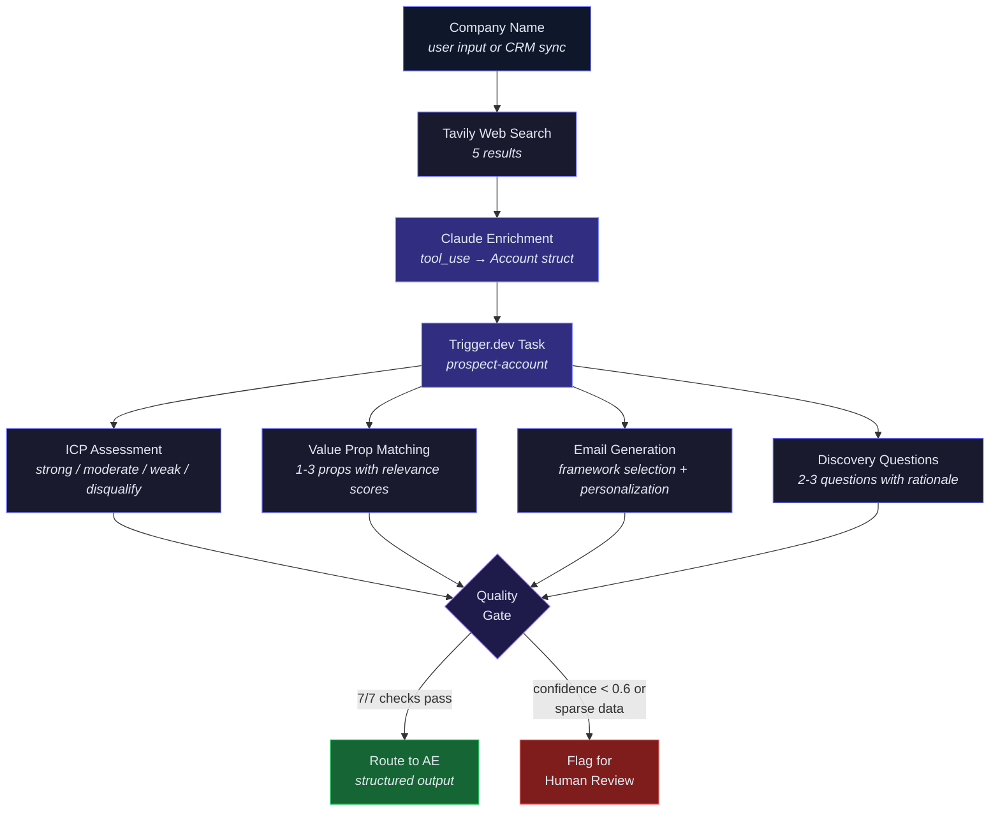

# Rula Prospecting Agent

AI-powered account qualification and outreach generation for Rula's employer AE sales motion. Enriches a company from the web, assesses ICP fit, matches value propositions, and generates personalized outreach — all through structured Claude outputs.

## Architecture



## How It Works

1. **Enrich** — Tavily searches the web for the company, Claude structures results into a typed `Account` (industry, employee count, health plan, contacts)
2. **Analyze** — Trigger.dev task runs the prospecting agent: ICP fit, value prop matching, email generation (5 frameworks), discovery questions
3. **Gate** — 7 quality checks validate the output. Confident results route to AEs; sparse data or low confidence gets flagged for human review

All outputs are Zod schema-enforced via `messages.parse()` — no freeform text parsing.

## Setup

```bash
npm install
cp .env.example .env  # Add ANTHROPIC_API_KEY

npx trigger.dev@latest dev     # Start task runner
cd web && npm install && npm run dev  # Start frontend
```

## CRM Integration

This prototype uses web search for enrichment, but in production it would read directly from Salesforce — replacing the Tavily step with CRM data that's already vetted by the sales team.

### Salesforce (read-only)

The agent would authenticate via **Connected App** with OAuth 2.0 and query existing Account/Contact objects:

```
GET /services/data/v59.0/query?q=
  SELECT Name, Industry, NumberOfEmployees, BillingState,
         (SELECT Name, Title, Email FROM Contacts
          WHERE Title LIKE '%Benefits%' OR Title LIKE '%Total Rewards%')
  FROM Account
  WHERE Id = ':accountId'
```

Scoped to `api` and `readonly` OAuth scopes — the agent reads account data but never writes back. Prospecting outputs (ICP fit, recommended email, value props) would surface in a custom Lightning component or as a Task/Note attached to the Account, written through a **separate, human-approved write path** managed by the business systems team.

### Why read-only matters

The agent needs account context to do its job, not admin access. Keeping CRM writes out of the agent's scope means:

- **No accidental data corruption** — the agent can't update fields, change ownership, or create duplicate records
- **Existing workflows stay intact** — assignment rules, validation rules, and approval processes aren't bypassed
- **Security review is straightforward** — read-only API scopes are a simple approval for the business systems team
- **Outputs stay reviewable** — AEs see the agent's recommendations before anything touches the CRM

In practice, the write path would be a separate service that the business systems team controls, taking approved prospecting outputs and writing them to the right objects/fields through Salesforce's or HubSpot's standard APIs.

---

*All company names, contacts, and account details in sample analyses are fictional. Live analysis uses real web data.*
